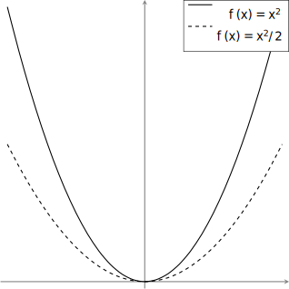

+++
title = "Creating Figures with Tikz"
description = "A non-comprehensive tour of some features of Tikz and document generation"
weight = 0
date = 2022-11-18
draft = true

[extra]
toc = true

[taxonomies]
tags = ["tex", "tikz"]
+++
## LaTeX and TikZ
[LaTeX](https://www.latex-project.org/) is a well-known typesetting system which is commonly used in the scientific and academic community for generating high-quality documents.
It is used especially in mathematics, since the quality and precision of mathematical typesetting is much better than the majority of other typesetting systems.

TikZ is a syntax layer over the macro package [PGF](https://ctan.org/pkg/pgf?lang=en), which is a TeX package for creating graphics.
When using TikZ, graphics are generated and specified via *commands*, rather than graphically, in the spirit of TeX not being a [WYSIWYG editor](https://en.wikipedia.org/wiki/WYSIWYG).
This in particular allows very fine-grained control over graphical output as well as automation of graphical generation.
Moreover, being a TeX package and using the underlying typographical system, images generated by TikZ fit stylistically into the surrounding document.
The main downsides of TikZ are that it can be challenging to learn, and (much like TeX) has an unforgiving syntax and can be challenging to debug.
However, in pursuit of typographical optimization, this is a small price to pay!

In this article I hope to showcase some interesting features and techniques in TikZ to generate basic graphs and plots.
For substantially more detail, you can find the [PGF package on CTAN](https://ctan.org/pkg/pgf?lang=en).
In particular, the “PGF Manual” included in the “Documentation” section has a very well-written and thorough tutorial-based introduction to a variety of features of PGF and TikZ.
There is also a very nice [web PGF manual](https://tikz.dev/) generated from the manual, based on [lwarp](https://ctan.org/pkg/lwarp?lang=en).
In this document, I will use pure TikZ: that is, any functionality that can be attained through `\usepackage{tikz}` or `\documentclass[tikz]{standalone}`.
Note that much of the functionality I describe here can be attained with less work (but more magic) using packages such as [pgfplots](https://ctan.org/pkg/pgfplots?lang=en).

### Basic drawing
First, in your preamble, you want to include the `tikz` package with `\usepackage{tikz}`.
Throughout this section, the document will be of the form
```tex
\documentclass{article}
\usepackage{tikz}
\begin{document}
...
\end{document}
```
with all the content inside the `document` environment.

There are two ways to invoke tikz: either inline with the `\tikz` macro, or using the `tikzpicture` environment.
Since we will focus on creating images to include in figures, we will use the `tikzpicture` environment.

A `tikzpicture` environment consists of a sequence of macro calls delimited by `;`.
The drawing itself is based on the usual cartesian coordinate system.
Options are passed to each macro using `[...]`.
For instance, the following picture
```tex
\begin{tikzpicture}
    \draw (0,0) -- (1,0);
    \draw (0,0) circle[radius=1];
\end{tikzpicture}
```
will draw a line from the coordinates `(0,0)` to `(1,0)`, and draw a circle centred at `(0,0)` with radius `1`.
Note that the default unit of measurement is `cm`.

### Making a plot with a legend
Our main focus will be to create a nice plot of a function, along with a legend.

Now, let's add a legend using `matrix`.
A `matrix` environment consists of a sequence of commands along with alignment characters (similarly to the `tabular` environment).
The `matrix` environment is very powerful and the details are relatively complicated.
You can read more about it [here](https://tikz.dev/tikz-matrices).

First, let's put a matrix at the top right corner, which has coordinates `(2.1,4.1)`.
We want to place the matrix `below left` from the coordinate, so that the top right corner of the legend is in the corner.
Also, since we do not want to see the plot behind the legend, we pass the option `fill=white`.
Note that every row (including the last) must end with `\\`.
```tex
\begin{tikzpicture}
    % axes
      \draw[thick, gray, ->] (-2.1,0) -- (2.1,0);
      \draw[thick, gray, ->] (0,-0.1) -- (0,4.1);

    % plots
      \draw[thick, smooth, variable=\x, domain=-2:2] plot ({\x}, {\x*\x});
      \draw[thick, dashed, smooth, variable=\x, domain=-2:2] plot ({\x}, {\x*\x/2});

    % legend
    \matrix [draw, fill=white, below left] at (2.1, 4.1) {
        \draw[thick] (0,0) -- (0.7,0); & \node {$f(x)=x^2$}; \\
        \draw[thick, dashed] (0,0) -- (0.7,0); & \node {$f(x)=x^{2}/2$}; \\
    };
\end{tikzpicture}
```
<figure>
  
  <figcaption>Our first attempt at a graph.</figcaption>
</figure>
However, we now have a number of small problems

1. The legend is much too large (or rather, our drawing is much too small!)
2. The lines that we have drawn do not align nicely with the label nodes.

To fix (1), we will simply make the drawing larger by passing the `scale=2` option to the overall picture.

To fix (2), we first need to identify the problem.
Essentially, when a node is created without specifying the location, the node is placed by default at `(0,0)`.
Moreover, since we gave the `below left` option to the `matrix` environment, the node is placed below and left of the coordinate `(0,0)`.
So when the matrix elements are aligned at `(0,0)`, this results in misalignment.

To make this visible, let's add temporarily add some small blue circles to the drawing:
```tex
\begin{tikzpicture}
    % axes
      \draw[thick, gray, ->] (-2.1,0) -- (2.1,0);
      \draw[thick, gray, ->] (0,-0.1) -- (0,4.1);

    % plots
      \draw[thick, smooth, variable=\x, domain=-2:2] plot ({\x}, {\x*\x});
      \draw[thick, dashed, smooth, variable=\x, domain=-2:2] plot ({\x}, {\x*\x/2});

    % legend
    \matrix [draw, fill=white, below left] at (2.1, 4.1) {
        \draw[thick] (0,0) -- (0.7,0); \fill[blue] (0,0) circle (2pt); & \node {$f(x)=x^2$}; \fill[blue] (0,0) circle (2pt); \\
        \draw[thick, dashed] (0,0) -- (0.7,0); \fill[blue] (0,0) circle (2pt); & \node {$f(x)=x^{2}/2$}; \fill[blue] (0,0) circle (2pt); \\
    };
\end{tikzpicture}
```
In order to fix this, we simply need to specify the node alignment manually.

Also, for now, we have manually placed the legend: but there is also a useful way to place objects relative to the current image.
However, the coordinate `(current bounding box.north east)` specifies the top left corner of the bounding box.
Finally, let's make the arrows a bit prettier using `>=stealth`.

Implementing these changes gives us the following code.
```tex
\begin{tikzpicture}[scale=2]
    % axes
    \draw[thick, gray, ->, >=stealth] (-2.1,0) -- (2.1,0);
    \draw[thick, gray, ->, >=stealth] (0,-0.1) -- (0,4.1);

    % plots
    \draw[thick, smooth, variable=\x, domain=-2:2] plot ({\x}, {\x*\x});
    \draw[thick, dashed, smooth, variable=\x, domain=-2:2] plot ({\x}, {\x*\x/2});

    % legend
    \matrix [draw, fill=white, below left] at (current bounding box.north east) {
        \draw[thick] (0,0) -- (0.7,0); & \node[right] {$f(x)=x^2$}; \\
        \draw[thick, dashed] (0,0) -- (0.7,0); & \node[right] {$f(x)=x^{2}/2$}; \\
    };
\end{tikzpicture}
```

### Scopes
Whenever options are given to a containing environment, the options are propagated to the child environments.
We can also manually create environments to allow propagation of variables, but without doing any drawing: this is done using the `scope` environment.
Doing this will increase readability and make it easier to change options later on.

In our drawing, we want to do this for the `\draw plot` macros and also the coordinate axis drawing:
```tex
\begin{tikzpicture}[scale=2]
    % axes
    \begin{scope}[thick, gray, ->, >=stealth]
        \draw (-2.1,0) -- (2.1,0);
        \draw (0,-0.1) -- (0,4.1);
    \end{scope}

    % plots
    \begin{scope}[thick, smooth, variable=\x, domain=-2:2]
        \draw plot ({\x}, {\x*\x});
        \draw[dashed] plot ({\x}, {\x*\x/2});
    \end{scope}

    % legend
    \matrix [draw, fill=white, below left] at (current bounding box.north east) {
        \draw[thick] (0,0) -- (0.7,0); & \node[right] {$f(x)=x^2$}; \\
        \draw[thick, dashed] (0,0) -- (0.7,0); & \node[right] {$f(x)=x^{2}/2$}; \\
    };
\end{tikzpicture}
```
If you wanted to align the nodes based on the text, you could use the `anchor=base` option in place of `right`.

## Some extensions
### Plotting from files
It is also possible to create a plot from a sequence of points specified in a file.

### Figures

### Subfigures and captions
The [subcaption](https://ctan.org/pkg/subcaption?lang=en) is very useful for this end.


## Externalizing files and standalone compilation
### Generating SVG Files
It is also useful to generate SVG files of the corresponding images.
For instance, this would be useful if you are writing an article about creating graphics with TikZ.

While SVG files can be created from the PDF output, for higher quality results, it is better to create a DVI file first and convert that to SVG.
This can be accomplished by using the standalone output from the previous section, the [ghostscript](https://www.ghostscript.com/) dynamic library, and the [dvisvgm](https://dvisvgm.de/) tool.
In order to generate the SVG, first compile the document to a DVI file with `latex` and then use `dvisvgm` to convert it to a SVG file:
{{cli(command="latex main.tex && dvisvgm main.dvi") }}
However, it is possible that the output will look something like this:

processing of PostScript specials is disabled (Ghostscript not found)
pre-processing DVI file (format version 2)
processing page 1
  WARNING: 190 PostScript specials ignored. The resulting SVG might look wrong.
  graphic size: ...
  output written to main.svg
1 of 1 page converted in 0.245896 seconds

In this situation, you will need to locate the ghostscript dynamic library file `libgs.dylib` and provide it as an argument to `dvisvgm`.
For instance, if this file is
```sh
/usr/local/ghostscript/10.0.0/lib/libgs.dylib
```
then you would run
{{ cli(command="dvisvgm --libgs=/usr/local/ghostscript/10.0.0/lib/libgs.dylib main.dvi") }}
The exact location will depend on your installation of ghostscript.
